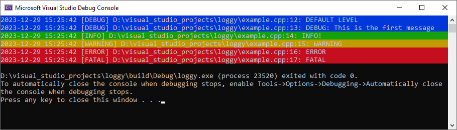

# Loggy: Header-Only C++ Logging Library

Loggy is a lightweight, header-only C++ logging library. It supports multithreaded environments and includes color coding for enhanced readability.



## Features
- **Header-only:** No need for additional compilation steps or external dependencies.
- **Multithreaded:** Designed to work seamlessly in multithreaded applications.
- **Color Coding:** Log messages are color-coded for different log levels, aiding quick identification.
- **Customizable:** Easily configure log levels, timestamp formats, source information formats, and log message formats.

## Getting Started

### Prerequisites
- C++11 or later compiler

### Build project
```
mkdir build & cd build
cmake ..
```

### Usage

First you'll have to include `loggy.h` into your project:
```cpp
#include <loggy.h>
```

A full example can be found in the [example.cpp](example.cpp) file.

#### Set the default log level:
```cpp
LOGGY_SET_DEFAULT_LOG_LEVEL(LogLevel::DEBUG);
```

#### Set the timestamp format ([See conversion specifiers](https://en.cppreference.com/w/cpp/io/manip/put_time)):
```cpp
LOGGY_SET_TIMESTAMP_FORMAT("%Y-%m-%d %H:%M:%S");
```

#### Set the source info:
```cpp
LOGGY_SET_SOURCE_INFO_FORMAT("%f:%l");
```
| Specifier | Explanation                                          |
|-----------|------------------------------------------------------|
| f         | The file path of where the log is being executed     |
| l         | The line in the file where the log is being executed |

#### Set the log format:
```cpp
LOGGY_SET_LOG_FORMAT("%t [%l] %s: %m");
```
| Specifier | Explanation            |
|-----------|------------------------|
| t         | The timestamp          |
| l         | The log level          |
| s         | The source information |
| m         | The log message        |

#### Logging using the default log level:
```cpp
LOGGY_LOG("DEFAULT LEVEL");
```

#### Logging using a custom log level:
```cpp
LOGGY_LOG("FATAL", LogLevel::FATAL);
```
